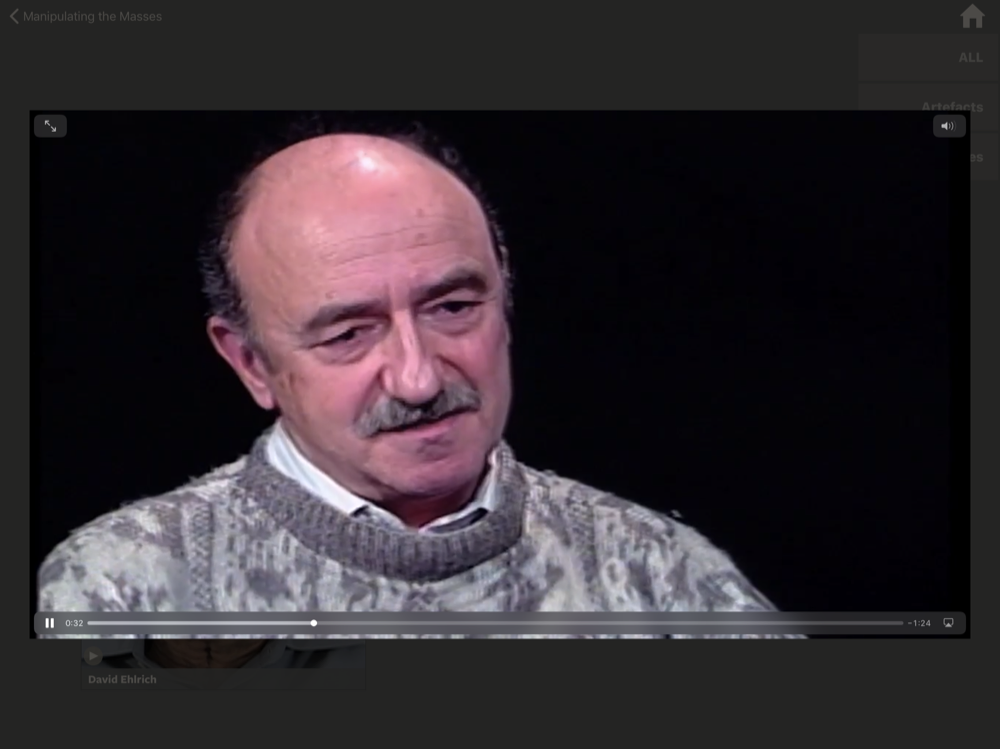

# Movie Viewer

The Movie Viewer is called up by tapping on a video thumbnail – all of which currently are accessible via a submenu. 

## The Player
The player itself is standard, with options for play/pause, fullscreen, etc. 

> Exiting a movie is similar to exiting an image, simply tap in the area around the movie.

## Interaction
For more on how to interact with the Movie Viewer, please see the following:

> [Viewing Movies](../interaction/interactiveElements.md#movieViewer)