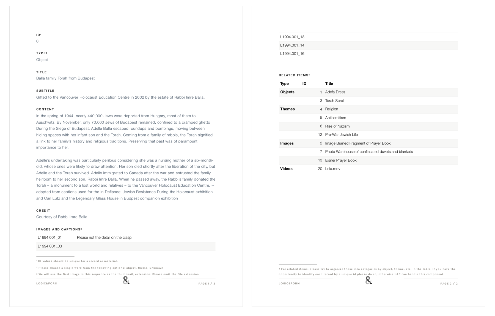
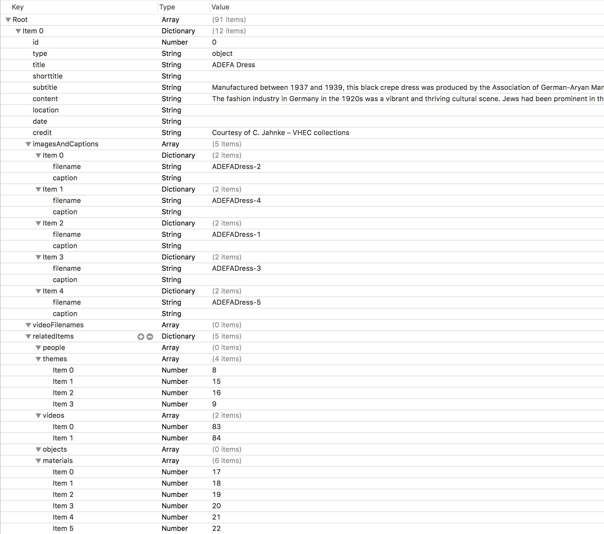

# Preparing Data

This section outlines how data should be prepared before being translated into software.

## Overview
The DC app is a standalone iOS application that has been designed and architected to meet a few key requirements:

* Easy to navigate.
* Provides rich content for reading / learning.
* Media-rich application, with images, video (and PDFs).

Since the DC app is standalone, it is designed to have all its content and media built-in.

To get data into the app, first it needs to be curated, written and formatted into documents and media folders by the IRSHDC team. Then, a developer will translate those documents and folders into software-ready formats.

### Sample Document
Here is an image of a sample document that would be writted by a member of the IRSHDC team:

> For more on how to prepare documents, and where to find templates, please see: [Preparing Data](preparingData.md)

### Document Reformatted for Development
After documents have been handed over, the development team will reformat into a `plist` file that looks similar to the following image: 

## Templates for IRSHDC Team
Since all entities in the DC app are represented as records, there is one key template for the IRSHDC team. 

### Record Template
The record template unpacks to show two documents and a media folder. The two documents are identical, the folder contains sample images named appropriately – image names are referenced in the documents.

> Please download the [recordTemplate.zip](files/recordTemplate.zip) file.

#### Filling In A Record
The process of filling in records will take some time, but is relatively straightforward. The document provided above has notes for how to fill in each element in the record. 

> Not all elements are required.

##### Required Elements
Here is the list of things a record **must** have:

1. An ID – this number must be unique and will be used to create links between objects.
2. A Title – this is more of a *should* because the record will render even though there is no title.
3. An Image – there should be at least 1 image of sufficiently high resolution (~144dpi, w: 512 x h: 1024) to allow for scaling, zooming, and fitting to the record layout.
4. A type - the type is used for filtering, and other logic within the app.

#### Optional Elements
Here is the list of things that can be included, but are not critical to the functionality of the application: 

1. Short Title - This is an alternate title for smaller UI elements (e.g. to be used in small thumbnails).
2. Subtitle – This is a subtitle for the the record.
3. Content – Some longer descriptive body of text.
4. Credit – A credit that can be added after the content in a record
5. Location	- A small text describing where the record is from.
6. Date	– A small text specify the date of the object.
7. Captions – short texts describing an image.
8. Video filenames – Typically there should be only a single movie per entry. If an interview is split into two components, then best practice is to create separate records for each part.

### Media Folder
Each record should be accompanied by a Media folder that contains images or video specific to the record. This folder should be kept in the same location as the document for the record.

## Handing Off Data
To ensure smooth handoff, please read through the following:

### A Folder for Each Record
Each set of record + media should be included in a folder titled `record` and suffixed with the identifier used in the document. Furthermore, since records require integer IDs, all folders should look similar to:

* record0 (contains `record0.pages` and a `media` folder)
* record1 (contains `record1.pages` and a `media` folder)
* record2 ...

### Images
Images should have the following format:

* .png (or .jpg)
* minimum-width: 1024
* minimum-height: 2048

> Please keep the formatting consistent (i.e. all images should be the quality and file type)

### Videos
Videos should have the following format:

* .mov or .mp4
* compressed/transcoded (to as small a size as possible without killing the a/v quality).

> The app [Handbrake](https://handbrake.fr) is an excellent tool for transcoding video.