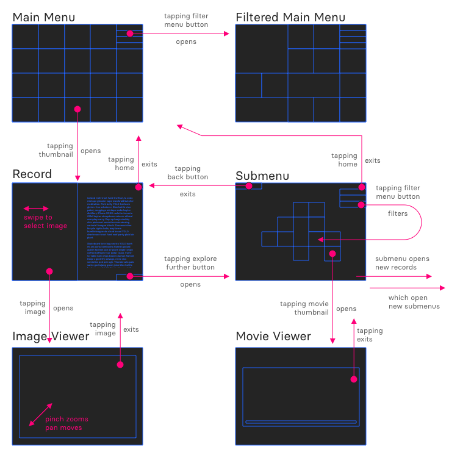

# Interaction Architecture

The entire DC app is made up of five types of views: 

* Menu 
* Submenu
* Record
* Image Viewer
* Movie Viewer

Moving between various menus is straightforward. The key interaction for exploring in the DC app is by launching a record, then tapping its explore further button to see a submenu related items, then opening another record. Like so:

`Record > Submenu > Record > Submenu > ...`

## Architecture Diagram

This diagram shows how to get from the main (or filtered) menu to a record. From a record to an image viewer or a submenu. From a submenu to a movie or another record.

### Actions
This is a text-version of the above diagram:

#### From the Main (or filtered) Menu:
1. Tapping a filter button opens a filtered main menu
2. Tapping a thumbnail opens a record

#### From a Record
1. Tapping an image opens an image viewer
2. Tapping the home button returns to the main menu
3. Swiping the image goes to the next image (if there are multiple images)
4. Scrolling the text view reveals more content
5. Taping the Explore Further button opens a submenu of related items

### From a Submenu
1. Tapping a filter button fades filtered thumbnails
2. Tapping a thumbnail opens a record
3. Tapping a movie thumbnail opens a movie viewer
4. Tapping the back button returns to the previous record
5. Tapping the home button returns to the main menu

#### From an Image Viewer
1. Pinching zooms the image
2. Dragging moves through the image (if zoomed in)
3. Tapping the image exits the viewer

#### From a Movie Viewer
1. The controls are like a regular movie player
2. Tapping the movie exits the viewer