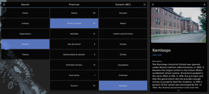

# Browse

The browse interface was designed with simplicity in mind. It's major goal is to provide a means for users to access any record in the system with a mimimal amount of effort.

Here is an example of opening a record from the browse UI:

## Information Structure
The browse interface uses a three-tiered structure for breaking down a path to access a record.

> Please see [Information Structure](structure.md)

## Design
The interaface for the browse menu is a simple, animated layout of lists.

> Please see [Design](design.md)

## Interaction
Interaction with the browse menu is simple.

1. Launch the browse interface from a button in the User Menu
2. Tapping on an entry in the **1st** tier *opens* the **2nd** tier
3. Tapping on an entry in the **2nd** tier *opens* the **3rd** tier
4. Tapping on an entyr in the **3rd** tier **opens a record.**
