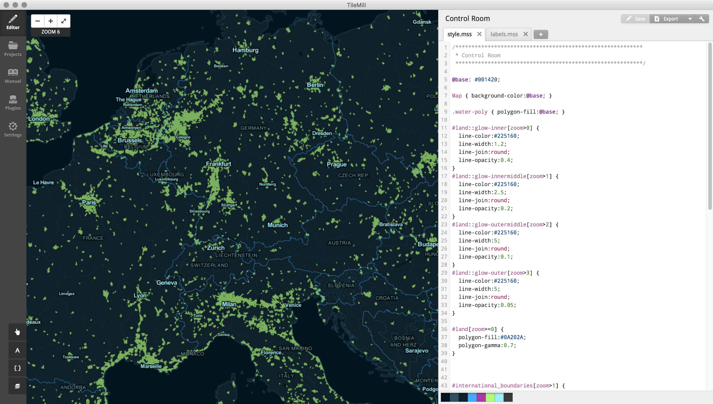
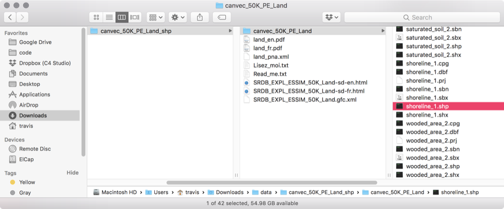
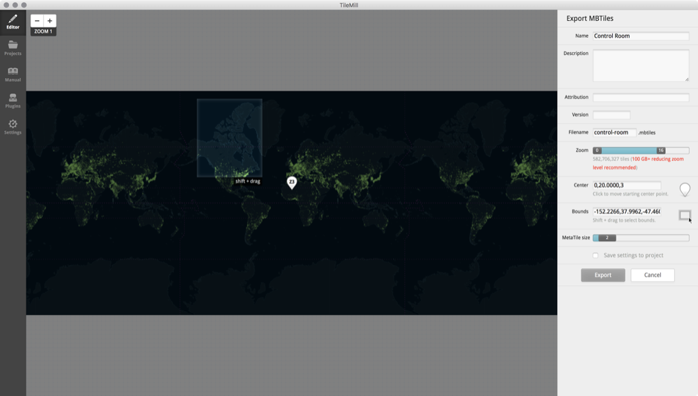

# Tiles
The Map Explorer uses an almost an out-of-the-box version of standard Apple Maps application. Even though they look very different, functionally they are almost identical.

To achieve the dark aesthetic we have generated a set of image tiles that we overlay on top of the map.

##TileMill
TileMill is a tool that lets us design maps using custom data. It is built on the powerful open-source map rendering library Mapnik - the same software OpenStreetMap and MapQuest use.



> To learn more, please see: [TileMill](http://tilemill-project.github.io/tilemill/)

###Styling
CartoCSS is a language used by TileMill classic styles. We specify aesthetic treatments for our data using this language, including choosing colors, applying different rendering at specific zoom levels, and filtering your data.

Here is an example of specifying the line color for an inner-glow effect.

```
#land::glow-inner[zoom>0] {
  line-color:#225160;
  line-width:1.2;
  line-join:round;
  line-opacity:0.4;
}
```

> To learn more, please see: [CartoCSS](https://www.mapbox.com/help/studio-classic-cartocss/)

The TileMill project for generating the tileset we use for the Map Explorer can be found on the iMac Pro.


##Data
We use three specific data types source from National Resources of Canada. These are:

* Shorelines
* Permanent Snow and Ice
* Road Segments

###Shorlines
The NRC describes this dataset as:

> Delineation of a waterbody. It generally represents the boundary between water and land, but also serves as the virtual demarcation between the sea and inland waters (tributaries).

You can learn more about this dataset here: [NRC Land - Shoreline Docs](http://ftp.geogratis.gc.ca/pub/nrcan_rncan/vector/canvec/doc/CanVec_Catalogue_50K_Land/SRDB_EXPL_ESSIM_50K_Land-sd-en.html#div-1190009)

The data set for shorelines can be found here: [NRC Land - Shorline SHP Files](http://ftp.geogratis.gc.ca/pub/nrcan_rncan/vector/canvec/shp/Land/)

####Finding a shp file
We needed to download and integrate dozens of shape files to fill out the entire country. To do so we followed these steps:

> We use the 50k datasets.

1. Go to the parent directory for the files, here: [NRC Land - Shorline SHP Files](http://ftp.geogratis.gc.ca/pub/nrcan_rncan/vector/canvec/shp/Land/)
2. Download a .zip file for a specific province. For example, [PEI Shorline Data](http://ftp.geogratis.gc.ca/pub/nrcan_rncan/vector/canvec/shp/Land/canvec_50K_PE_Land_shp.zip)
3. Find the **shorline.shp** file.
4. Add the file as a new layer in the TileMill project



###Permanent Snow and Ice
The NRC describes this dataset as:

> Permanent snow and ice such a glacier, ice cap or ice field.

You can learn more about this dataset here: [NRC Land - Permanent Snow and Ice Docs](http://ftp.geogratis.gc.ca/pub/nrcan_rncan/vector/canvec/doc/CanVec_Catalogue_50K_Hydro/SRDB_EXPL_ESSIM_50K_Hydro-sd-en.html#div-1210009)

The data set can be found here: [NRC Land - Permanent Snow and Ice SHP Files](http://ftp.geogratis.gc.ca/pub/nrcan_rncan/vector/canvec/shp/Hydro/)

#### Finding a .shp file
The process is identical to the steps listed in [Finding a .shp file](#finding-a-shp-file)

###Road Segments
The NRC describes this dataset as:

> A road is a linear section of the earth designed for or the result of vehicular movement. A road segment is the specific representation of a portion of a road with uniform characteristics.

You can learn more about this dataset here: [NRC Land - Road Segment Docs](http://ftp.geogratis.gc.ca/pub/nrcan_rncan/vector/canvec/doc/CanVec_Catalogue_50K_Transport/SRDB_EXPL_ESSIM_50K_Transport-sd-en.html#div-1330009)

The data set can be found here: [NRC Land - Road Segment SHP Files](http://ftp.geogratis.gc.ca/pub/nrcan_rncan/vector/canvec/shp/Transport/)

#### Finding a .shp file
The process is identical to the steps listed in [Finding a .shp file](#finding-a-shp-file)

###Tileset
After testing and editing the stylesheet for the maps, we generate a set of tiles that will eventually be used in our application. 



We export a set of **MBTiles**.

Here are some docs that come in handy when working with TileMill:

* [Adding a shapefile layer](http://tilemill-project.github.io/tilemill/docs/guides/add-shapefile/)
* [Styling Data](http://tilemill-project.github.io/tilemill/docs/crashcourse/styling/)
* [Exporting a Map](http://tilemill-project.github.io/tilemill/docs/crashcourse/exporting/)

##Longevity of TileMill
TileMill is an open-source project, and has been maintained by users for quite some time. The project was most recently updated in November 2017, and as of August 2018 the application still runs on MacOS (10.13). 

Though there is the possibliity of TileMill not being supported by future versions of MacOS, the current stable build will be sufficient for quite some time. We will not be actively updating the OS version on the iMac Pro, so TileMill will be able to run on that machine for the duration of the project.

###Open Source Repository
The link below will take you to the open source repository for TileMill.

[TileMill on Github](https://github.com/tilemill-project/tilemill) 

