# Design Update

September 28, 2018

Logic&Form is currently working through a design update of the aesthetic for all interactive applications.

## Direction
Since early 2018, the aesthetic direction of the wall has been themed around darker colors for windows and interactive visualizations, allowing brighter typography and colored images to elegantly stand out. This approach allows content to be seen first, with all other visual aesthetics taking a secondary position.

One of the critical reasons for this approach is the ease of reading, viewing, and spending time in front of the screens.

If we go with a light-colored theme, the intensity of viewing up close the UR9851 screens would drastically reduce the amount of time an individual would be able to stand in front of the screens. 

> A bright-themed approach would hurt the eyes.

In reflecting on the current visualization, which has a dark-grey map / background, with deep-black windows and white text, we have considered the following key elements:

1. The starkness of black windows is too hard.
2. The background shows itself brightly around content.
3. Inverting this aesthetic, will make conent even more forthcoming than it currently is, while easing the harsh constrast of readable text.

## Proposal
We are proposing making the aesthetic layers (i.e. map, timeline background, node) darker, while shifting the background color of records to a deep grey.

> This approach is very much in line with new trends in dark interface modes for modern operating systems.

## Map Explorer
Here are a set of graphics that illustrate the direction for the Map Explorer.

> Note that these show a general aesthetic direction, specific implementation details will be worked out by testing and adjusting directly on the UR9851 screens.

### Updated Grey Aesthetic
This image focuses on the updated grey aesthetic. Specifically, this image shows the related-records view, but will apply to all windows.

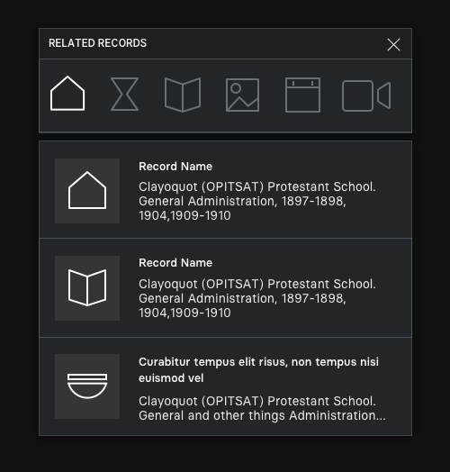

Things to note:

1. Darker background behind the window
2. Dark-grey background on the window (instead of the current black)
3. A light border to distinguish the edges of the windows
4. Light-grey tint behind icons in related items
5. Dark shadow on the windows – almost imperceptible here, but when overlaid on the main UR9851 screens this touch makes the currently focused window pop.

Things to NOT really note:

1. We're showing some new icons, but the order isn't confirmed.
2. Related record icons here are white – not confirmed.

### Records
Here is an update to the record view.

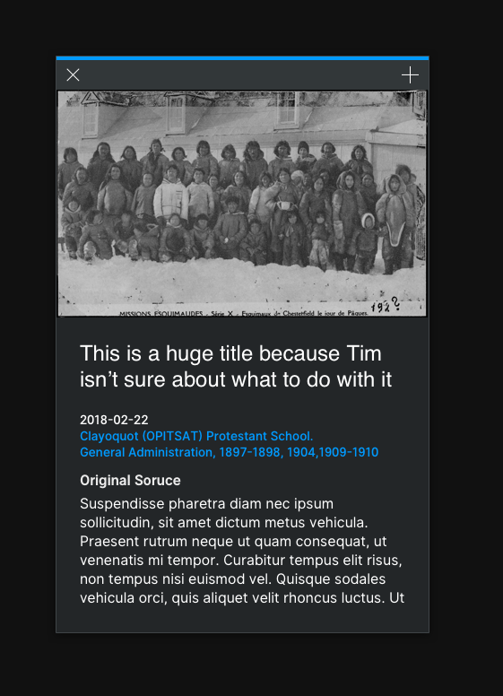

Things to note:

1. Very similar in layout to current records.
2. Highlight bar moved up and thickened.
3. Touch area is lighter than the main background color – makes is a visually distinct elemnent to drag.
4. Tightened gaps between typography elements (e.g. title, date, body copy)
5. NOTE: we intend to add animation to the draggable bar.

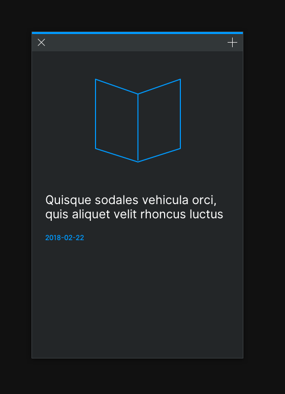

1. The touch area is apparent in contrast to the primary background color of windows.

### Highlight Colors & Pins
Here is an update to the primary highlight colors for the applications. There are 6 main types of record to show: Schools, Events, Organizations, Artefacts, Individuals, Collections. We have created a palette of colors that can be used throughout all applications, that are distinctly different from one another, and that stand out from the dark backgrounds of the aesthetic.

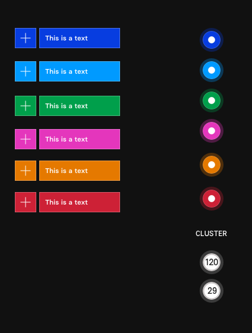

Things to note:

1. 6 distinct colors - we haven't yet chosen the association to record type.
2. A sharper pin aethetic – using the colors – with a small white point in the center.
3. Cluster aesthetic – white pins with the number of elements in the cluster.

### Browse
A simple update to the browse menu will reduce its overall width.

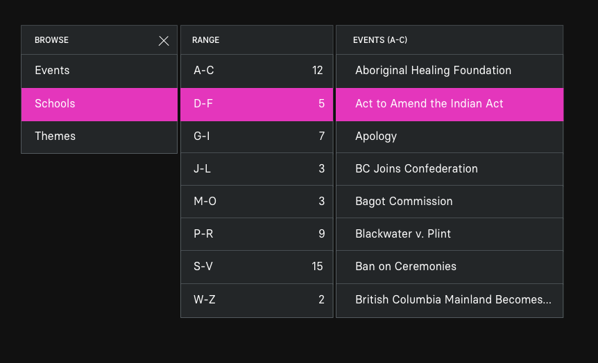

Things to note:

1. Smaller columns where appropriate.
2. Reduced elements on the primary column.
3. Left-aligned text.

### Help
We intend to update the help menu by adding buttons to make it easier to move from one piece of content to another.

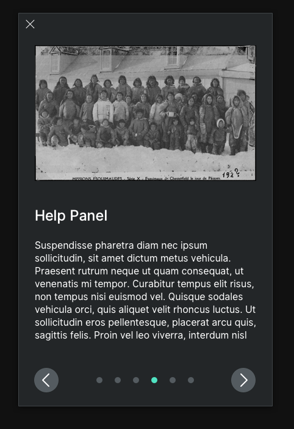

Things to note:

1. Left-right buttons at the bottom.
2. Title in a more consistent position compared to those of records.
3. Looser spacing between page indicator dots.
4. New highlight color for page indicator dots.

### Video Player
Here is what the video player will generally look like with the new background and border colors:

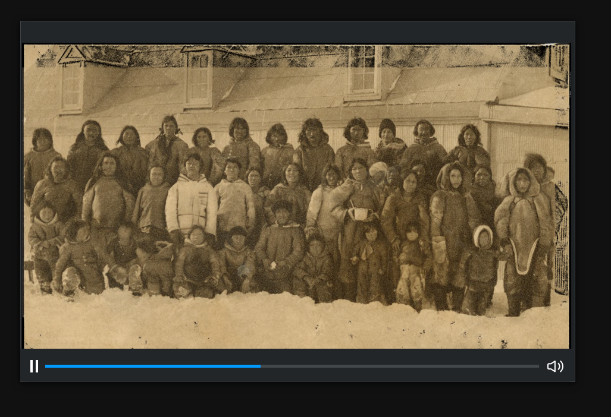

Things to note:

1. This is a quick sketch, some visual elements have been omitted from this image.
2. Functionality will remain the same as it currently is.

### Image Filter Collection Layout
This treatment shows the new background / border color aesthetic on the image collection filter.

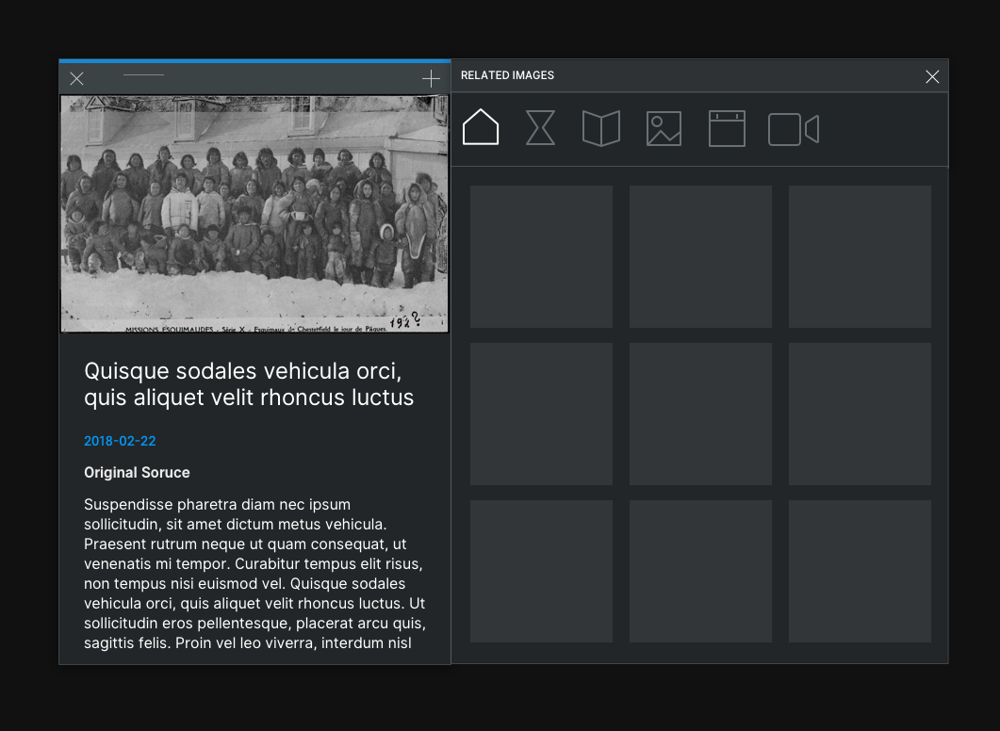

Things to note:

1. Images are no longer separated by clear gaps.
2. Spacing between images is tighter.
3. Filter menu is a single header without gap between the title bar and the filter buttons.

### Menu
This treatment shows a more sophisticated version of the menu, which maintains its current functionality while applying new aesthetic techniques to bring it to life.

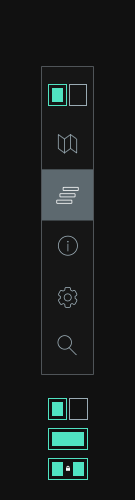

Things to note:

1. Updated icon for the split / join / lock element.
2. A more tonally appropriate background color for selected elements.
3. The menu will still extend with titles.

Things to not note:

1. There is a blurred background, check out the next two images...
2. We don't plan to re-introduce the settings function.

#### A Blurred Background
Blurring the background of the menu will visually bring it to life. Conent is underneath the menu will be blurred, and if it is not moving this effect will make the menu visually distinct. As content is moving underneath the menu will come alive as its background shifts / flickers.

Here is an example of the blurred background with colored pins underneath.

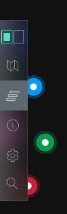

Here is an example of the blurred background with a record underneath.

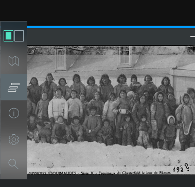