# Processing Data

The goal of this document is to clearly outline how the various parts of a record's data show up in the interface of the DC app. To do so, we will break down the various components of a record into their visual representations in the UI.

> We are using the UI for the VHEC version as the basis of this document. 

### type
The type of an object doesn't explicitly show up in the UI, however, the processing and final representation is informed by this property.

#### Filtering
The most common use of the `.type` property is to filter a menu. In the images below you'll see 4 different cases of filtered content.

##### Main Menu Filtering
When the main menu is filtered, its excluded elements are omitted from view and the remaining elements animate into new positions.

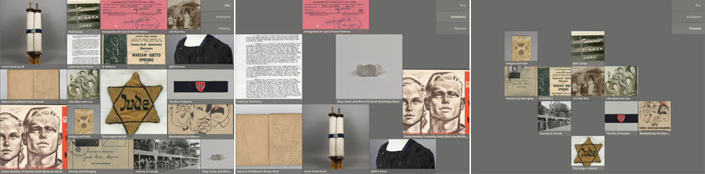

##### Submenu Filtering
When a sub menu is filtered, its excluded records are still visible – but with a significantly reduced opacity.

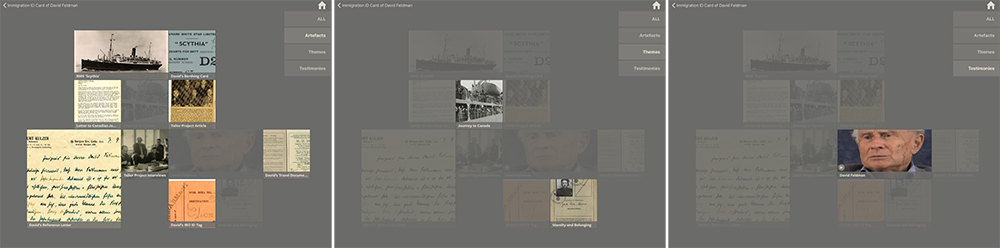

### title
The title appears at the top of a record's text view. It is a larger font and wraps to become multi-line if needed.

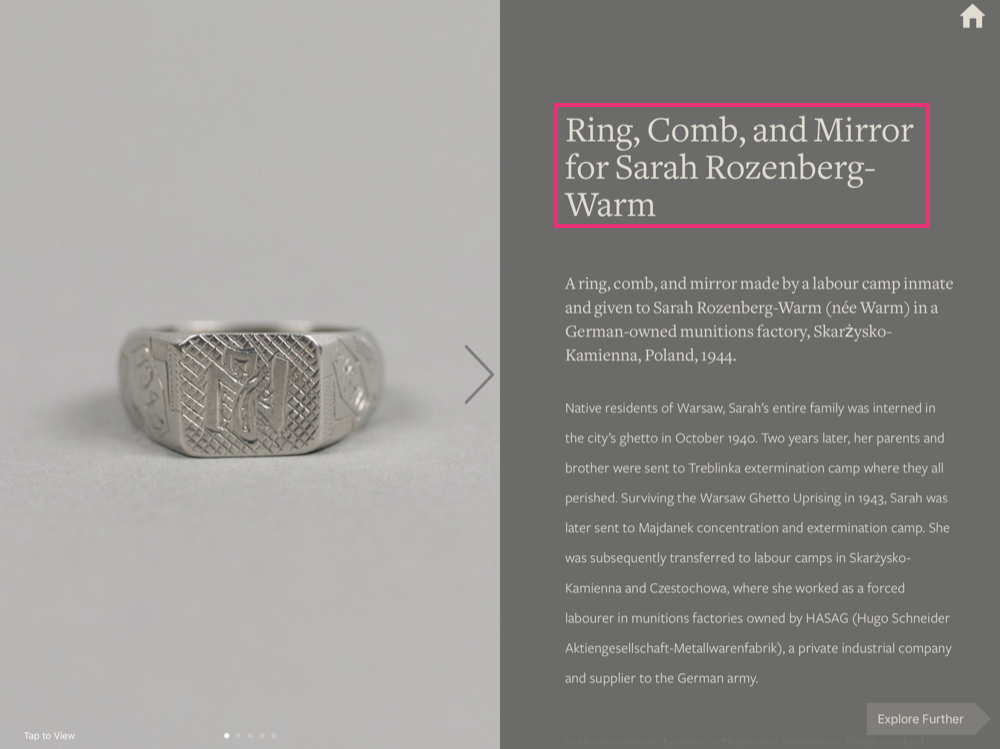

### subtitle
If a subtitle is present, it appears directly underneath the title in a smaller font (though still larger than the bodt content font).

### content
If present, the primary body content appears below the subtitle.

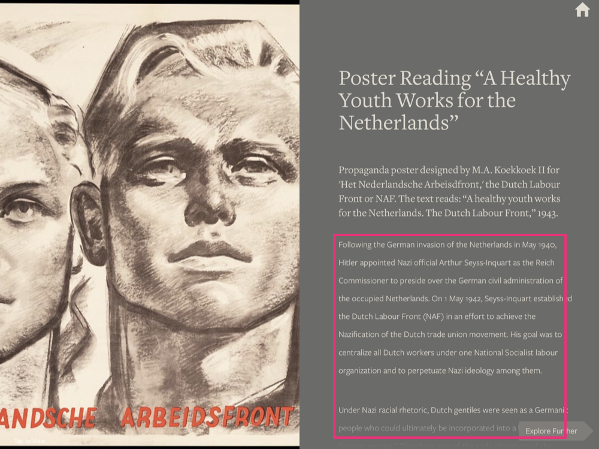

### location
If present, the location is added as a small line of text between the title and subtitle.

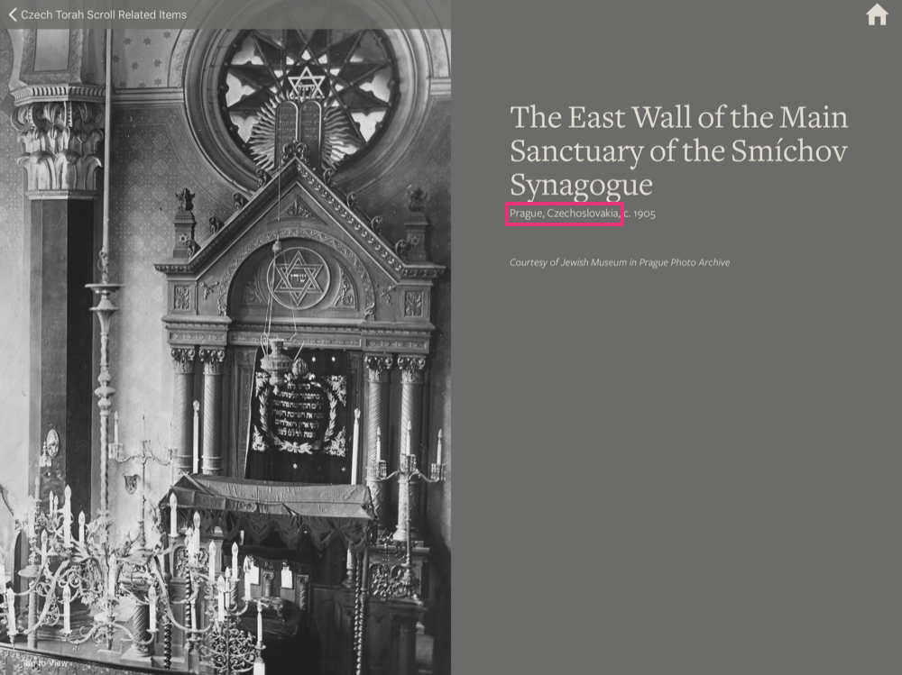

### date
If present, the date is added after the location (separated by a comma).

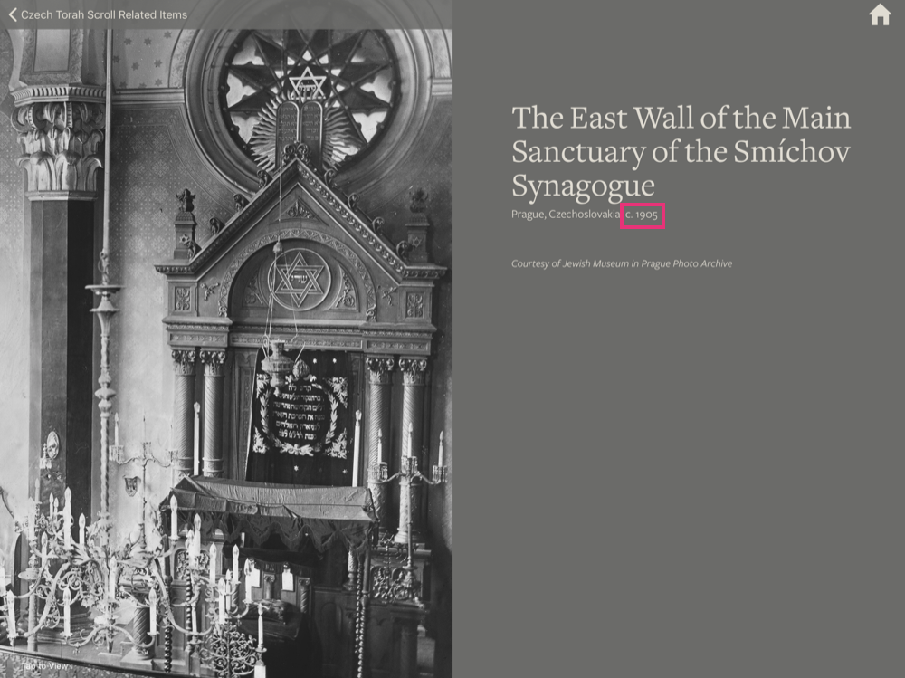

### credit
If present, the credit appears at the bottom of the body content and uses a small font.

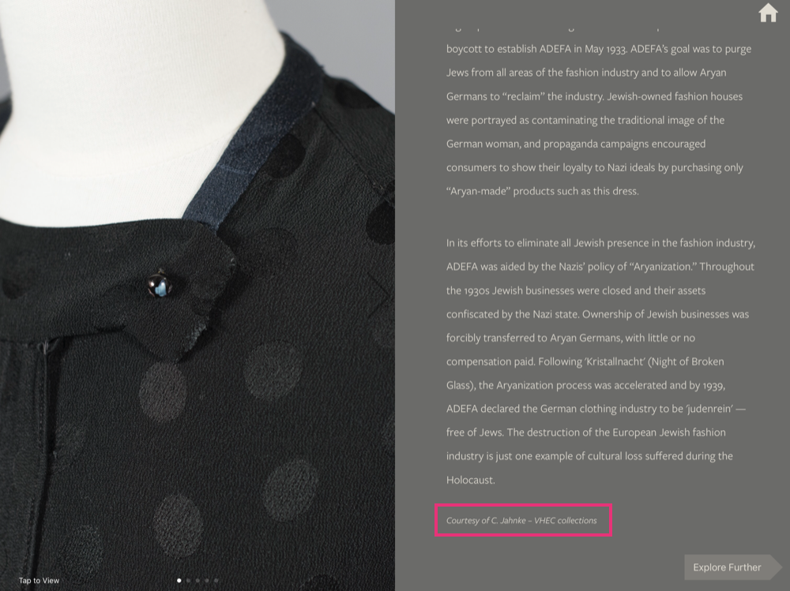

### imagesAndCaptions 
Images will be presented in the left-hand portion of the screen. If there are multiple images, the will be added to a scrollable collection view and a page counter will appear at the bottom of the view.

> There should always be at least 1 image – however a placeholder could be used if needed.

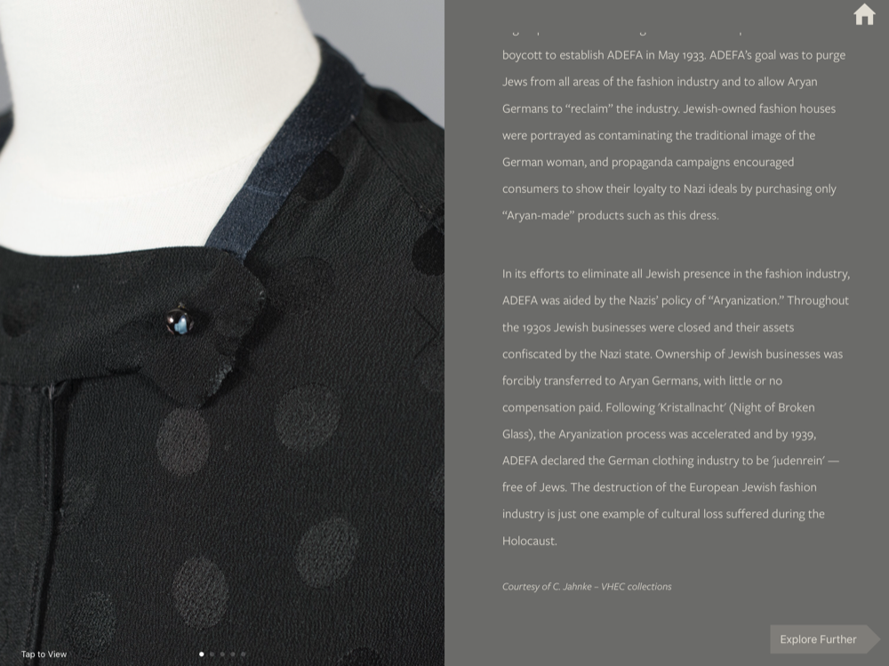
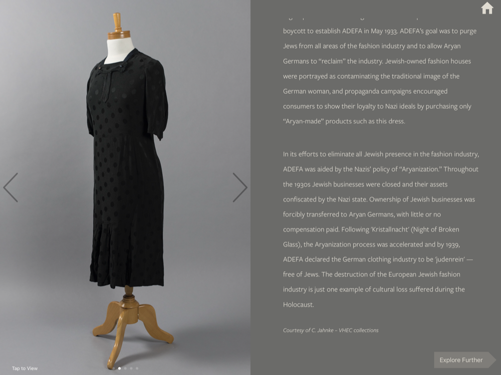
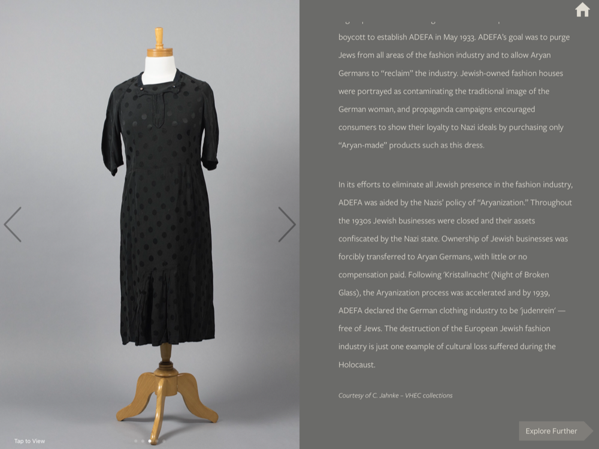
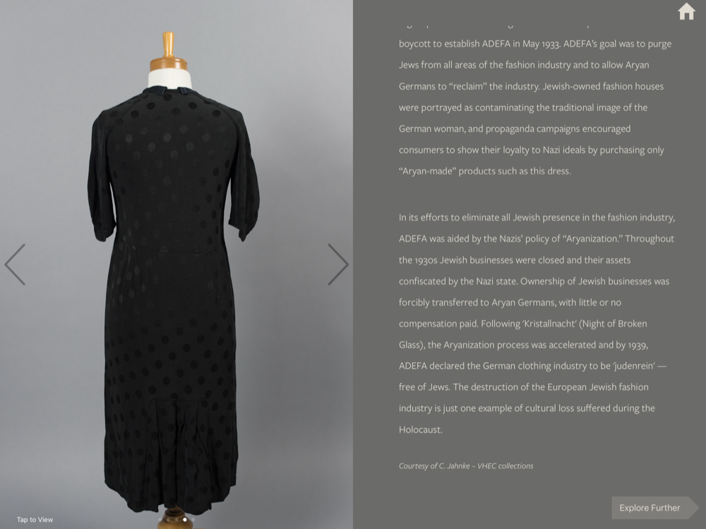
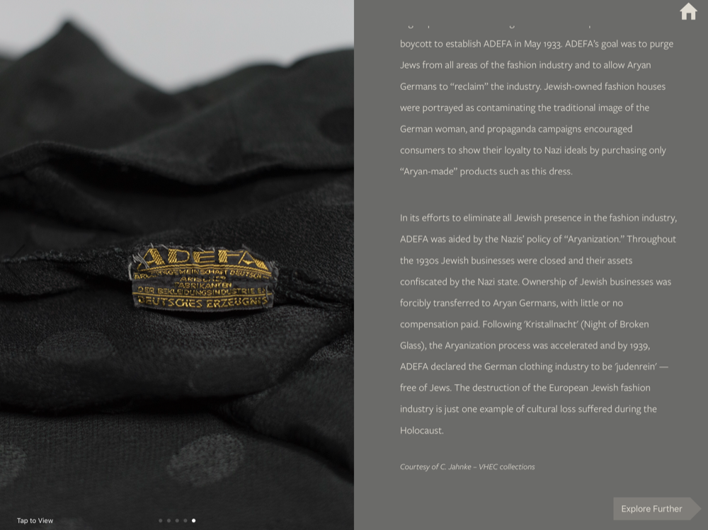

### relatedItems
Related items are listed in a separate view from the record, accessible via an **Explore Further** button that appears only if there is at least 1 related item.

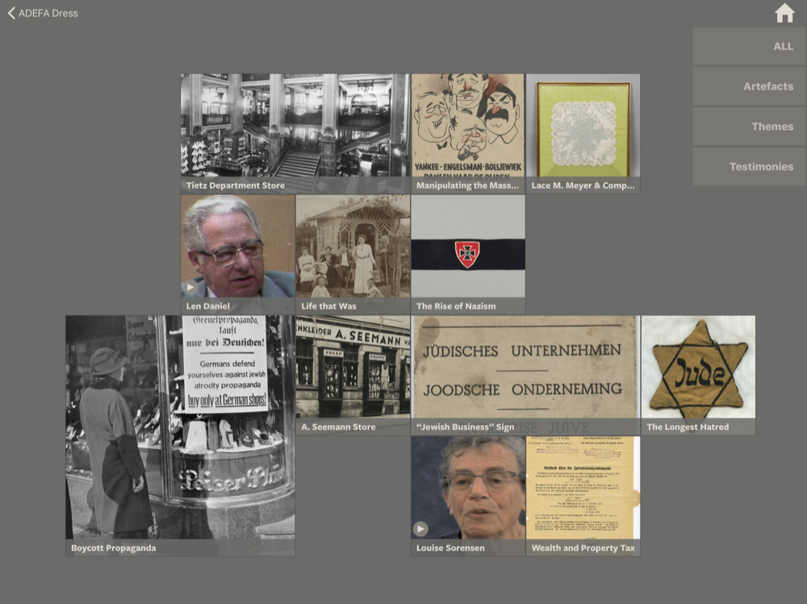