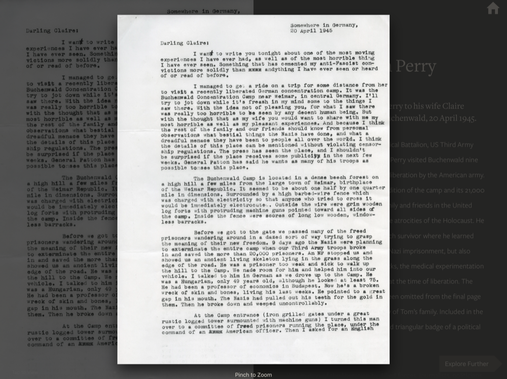

# Image Viewer

The Image Viewer is called up from a Record Viewer. After scrolling back / forth between images in the record viewer, the image presented in the Image Viewer is the one currently visible in the record.

## Default Layout
The default layout is to fit the current image into the frame of the app, with a small margin on all sides. 

The image will be scaled appropriately depending on whether or not it is portrait or landscape.

### Sample Record
Here is a sample record with an image to inspect.

### Portrait Default
After tapping the image above, the viewer shows a portrait-oriented image.

#### Zoomed In
After pinching to zoom, the image fills the entire screen.

## Interaction
For more on how to interact with the Image Viewer, please see the following:

> [Viewing Images](../interaction/interactiveElements.md#launchImageViewer)