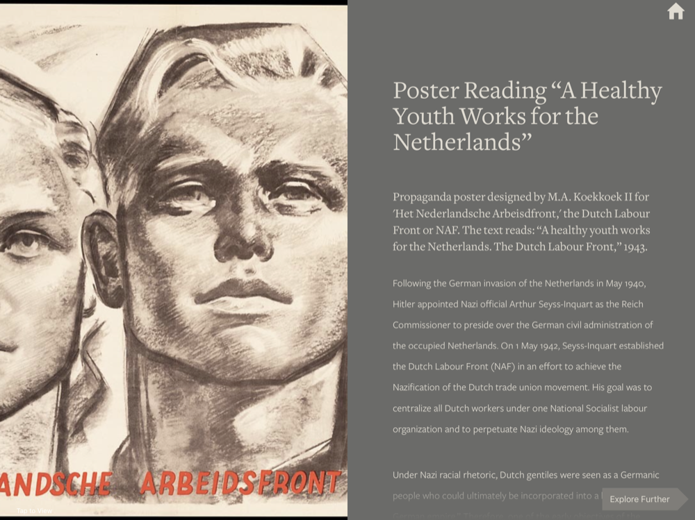
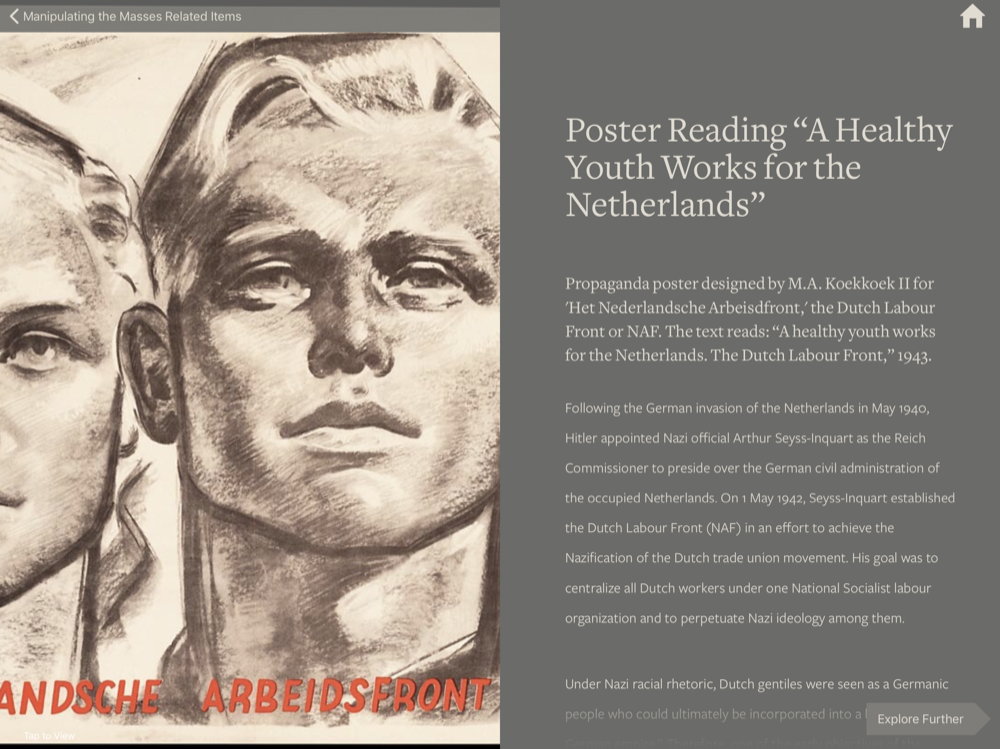

# Record Viewer

The main screen for the DC app, the record viewer is designed to show high-quality images alongside nicely laid out typography. In the following two images you'll see a version that appears after being selected from the main menu, and another with a back button that appears if it is selected from a submenu.

## Opened from Main Menu

## Opened from Submenu

## Interaction
For more on how to interact with the Record Viewer, please see the following:

> [Scrolling Images](../interaction/interactiveElements.md#scrollingImages)

> [Viewing Images](../interaction/interactiveElements.md#launchImageViewer)

> [Scrolling Content](../interaction/interactiveElements.md#scrollingContent)