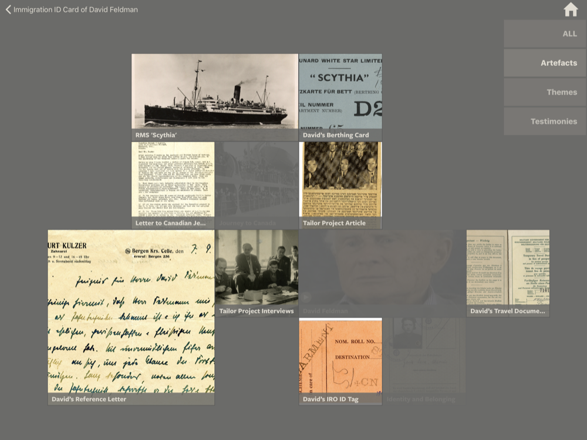
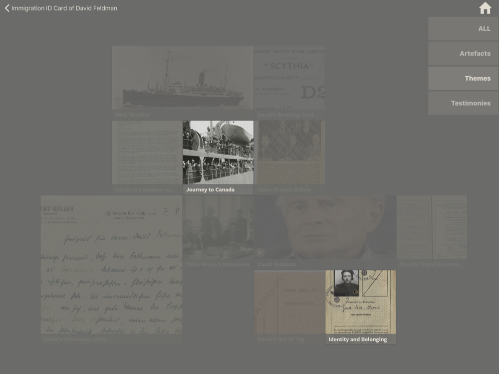
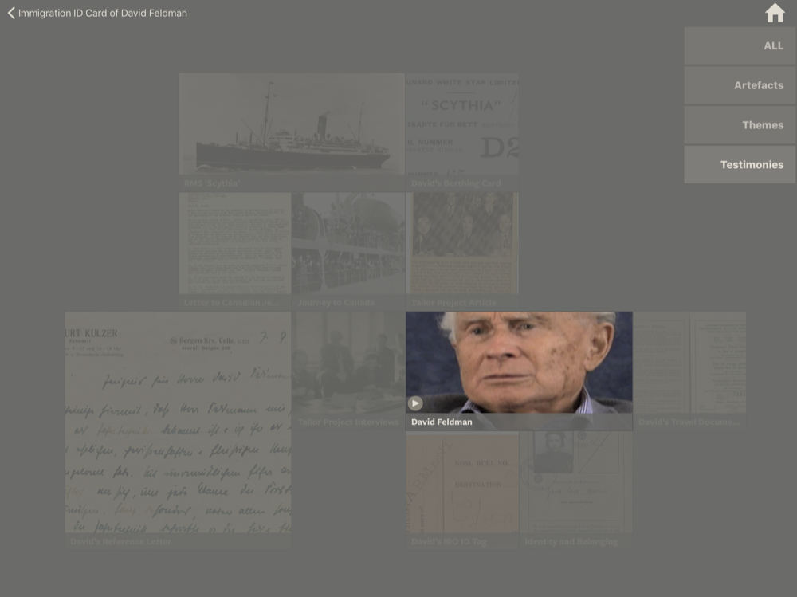

# Submenus

Submenus contain thumbnails and references to entities that are related to a specific record.

> The following designs were commissioned for VHEC – new designs will be created for IRSHDC.

## Layout
A submenu consists of a dynamic grid of thumbnails that have the following description / size:

* Small square (1 x 1)
* Rectangular (2 x 1)
* Large square (2 x 2)

> The current design allows for up to 10 thumbnails / related entities.

## Filtering
The submenu can be filtered by tapping one of the options in its menu. Filtering disables interaction and fades some thumbnails from the view.

### Filtered for Artefacts

### Filtered for Themes

### Filtered for Movies
