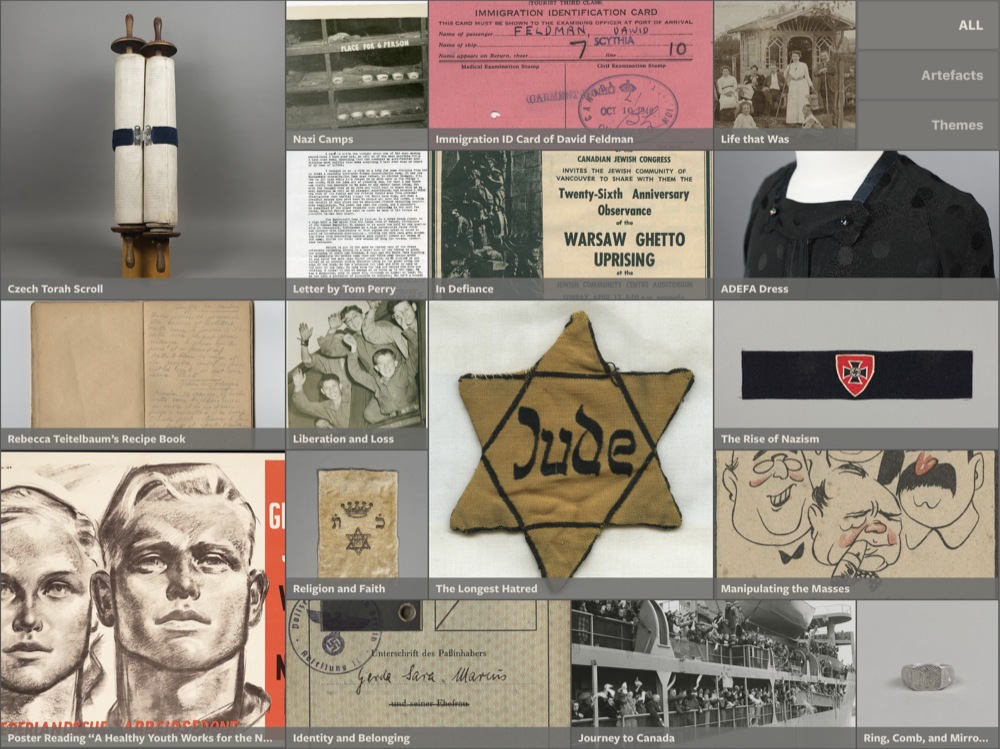
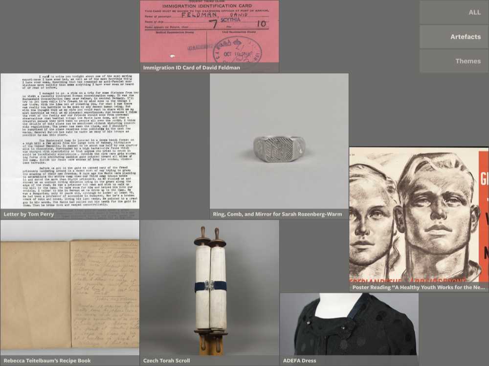
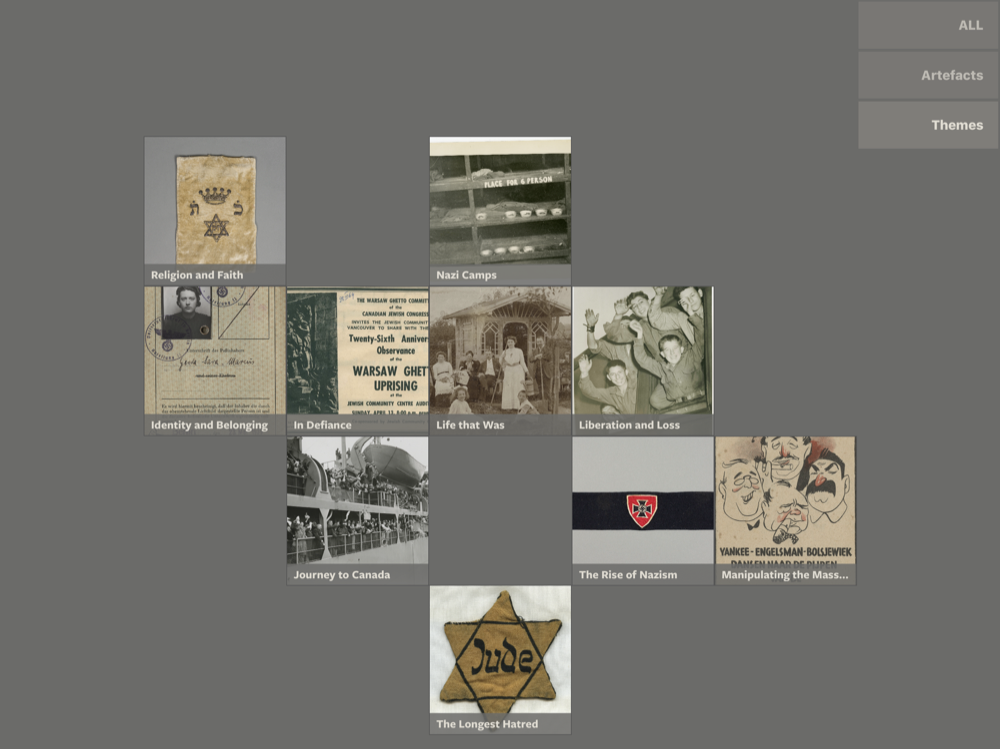

# Main Menu

The main menu is the primary entry-point into the application. It is also the location back to which a user will land when they wish to restart their exploration.

> The following designs were commissioned for VHEC – new designs will be created for IRSHDC.

## Layout
The main menu consists of a dynamic grid of thumbnails that have the following description / size:

* Small square (1 x 1)
* Rectangular (2 x 1)
* Large square (2 x 2)

> The current design allows for up to 23 thumbnails.

## Filtering
The main menu can be filtered by tapping one of the options in its menu. Filtering removes some thumbnails from the view.

### Filtered for Artefacts

### Filtered for Themes
