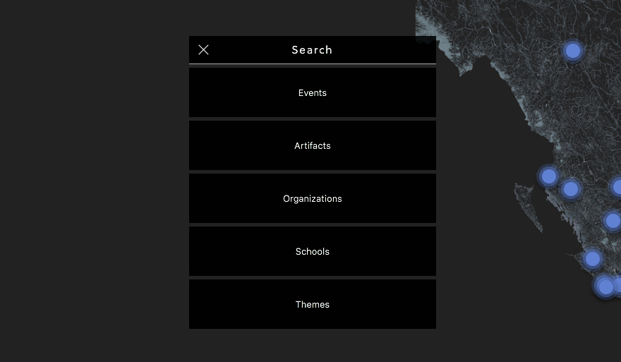
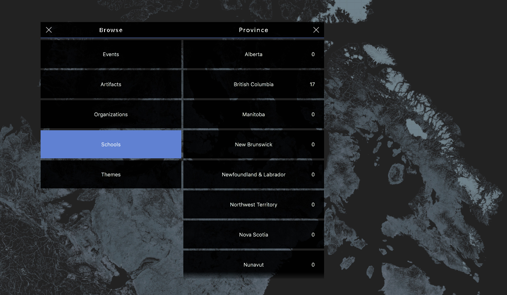
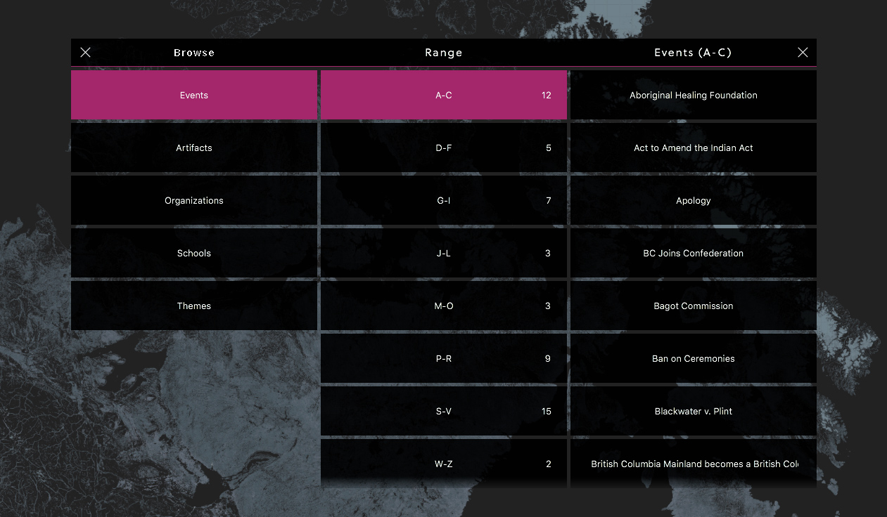
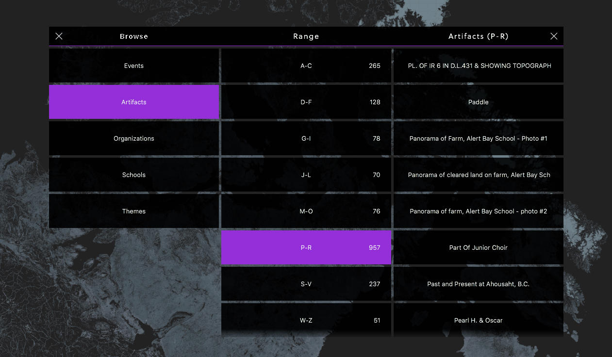
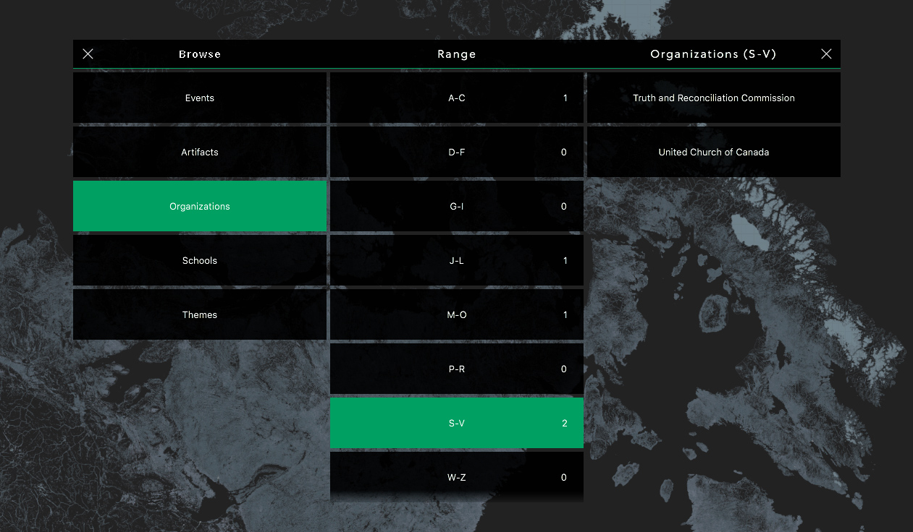
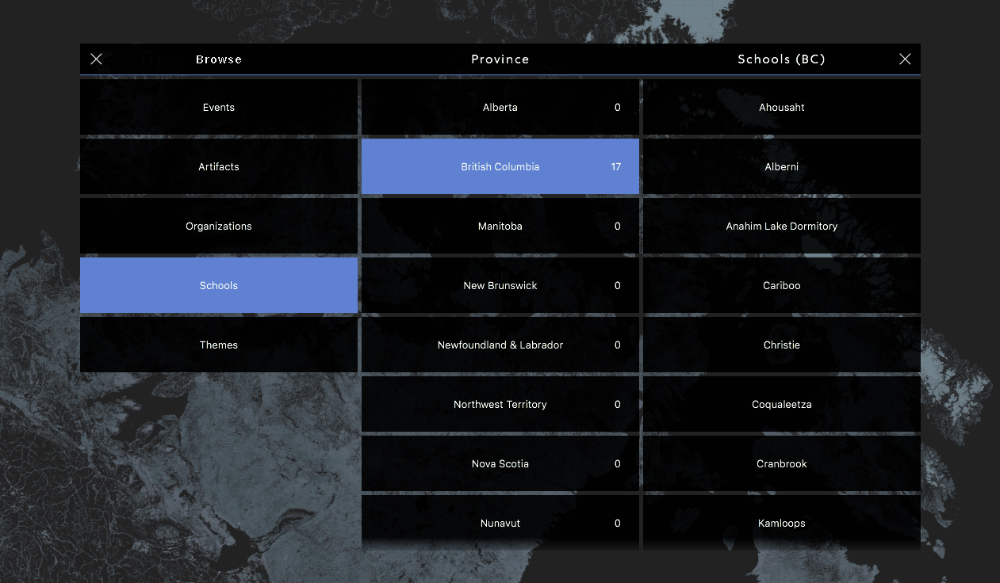
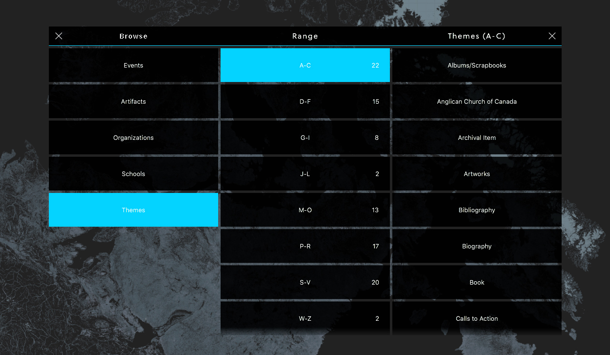

# Design
The interaface for the browse menu is a simple three-tiered, animated, layout of lists.

Here you can see the interface that opens after tapping the browse button from the User Menu.

> The title of this tier can easily be changed.

After tapping on an element in the first, or second list, the next tier will open up. Here is an example of the second tier open:

## Events
Here is what the third tier for Events looks like:

## Artefacts
Here is what the third tier for Artefacts looks like:

## Organizations
Here is what the third tier for Organizations looks like:

## Schools
Here is what the third tier for Schools looks like:

## Themes
Here is what the third tier for Themes looks like:

