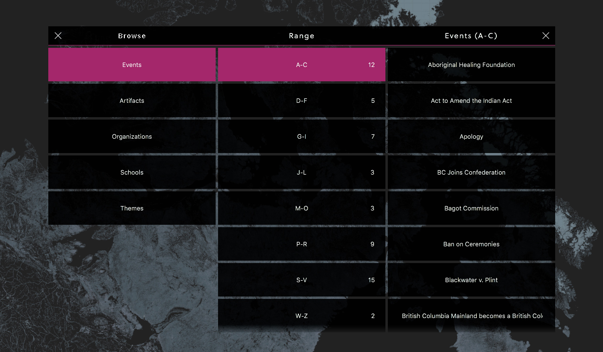
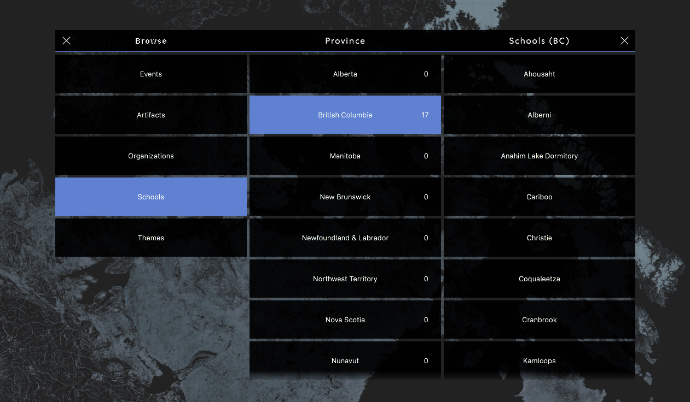

# Information Structure
The browse interface uses a three-tiered structure for breaking down a path to access a record. 

## Tier 1 – High-level Sections
The first tier of the interface is high-level sections that map to the data available in the system. Currently, there are: 

* Events 
* Artefacts
* Organizations
* Schools
* Themes

## Tier 2 – Categorized Breakdown Menu
The second tier is a categorized breakdown of the high-level section that was selected. The entries in this tier are organized by pre-defined rules and can have a variety of formats based on the context of the currently selected high-level section.

* Events – Alphabetical Ranges
* Artefacts – Alphabetical Ranges
* Organizations – Alphabetical Ranges
* Themes – Alphabetical Ranges
* Schools – Provinces
* Themese – Alphabetical Ranges

As you can see, the majority of tier 2 lists are organized by alphabetical range.

Each entry in a tier 2 list is marked by the number of records that pertain to the category.

> These tiers are NOT dynamic. They need to be defined by the IRSHDC and coded into the installation. 

### Alphabetical Range
Here is an example of alphabetical range:

### Province Range
Schools are organized by province. This is currently the only tier 2 list that is non-alphabetical. It is a good example of how other sections could be broken down into non-alphabetical categories if needed. 

After the user taps on the browse button from the User Menu – located to the edge of a screen – the browse UI pop

## Tier 3 – Alphabetical List
The third tier is a dynamically generated list of entries that pertain specifically to the selected element that the user just selected in tier 2.

In this list, elements are organized alphabetically.

Tapping on a third-tier entry will open a record.