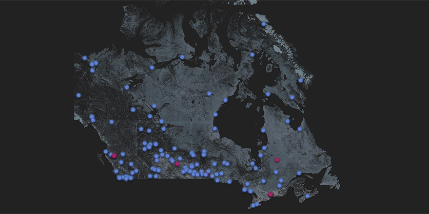
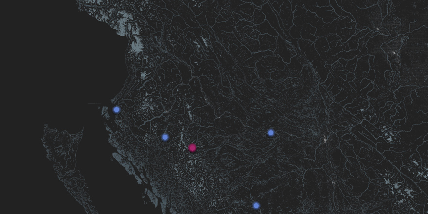
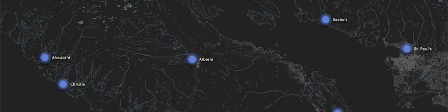

# Schools & Events
Schools and Events are represented by custom annotations. In the image below you'll see that the majority of pins on the map are Schools (blue).

As a user zooms into the map, the annotations remain the same relative size while the map expands.

Annotation titles can appear once the map is sufficiently zoomed in.

