# Map Aesthetic
The look and feel of the map takes on a dark asthetic for a few important reasons, because it:

1. Allows the brighter annotations to be more visually apparent.
2. Is easier on the eyes – than white background – at close proximity.
3. Provides an excellent foundation for imagery and video.

> For a technical description of how we generate the aesthetic, please see: [Tiles](tiles.md)

## Data Layers
The look of the map is made up of 3 types of data, all sourced from National Resources of Canada (NRC). These layers include:

* Shorelines
* Permanent Ice & Snow
* Roads

### Shorelines
The primary aesthetic for the map is a tracing of all shorelines in Canada. When drawn out with a very small / thin line thickness, the close proximity and multitude of shorelines (especially in places like northern Québec) lend their weight to a full and visible representation of the country without explicitly drawing the borders of provinces.

The data files for shorelines can be found here: [NRC Shoreline Data](http://ftp.geogratis.gc.ca/pub/nrcan_rncan/vector/canvec/shp/Land/)

From a high vantage point, the shape of Canada is clearly represented by shoreline data.

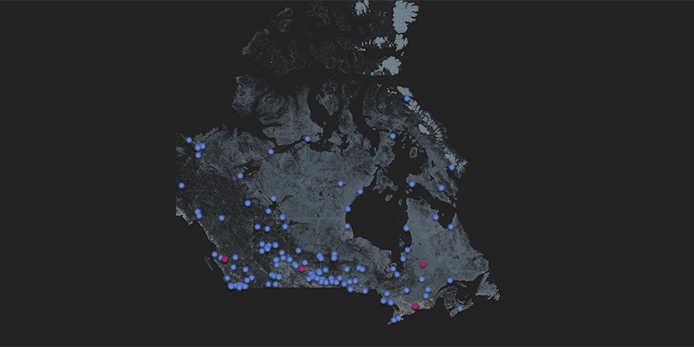

The topography of Canada also becomes apparent. In the following image, the mountain ranges in the west have far fewer shorelines compared to the flatter central provinces.

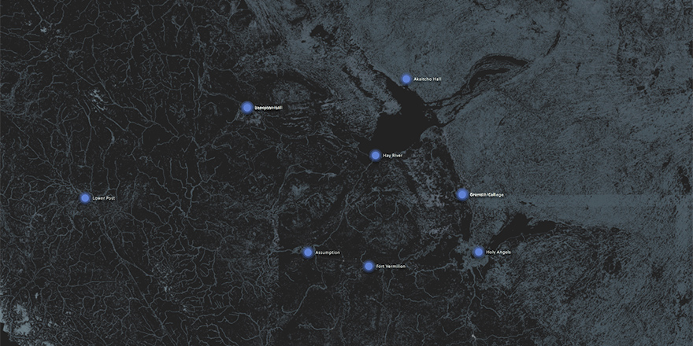

The style of map drawing changes at every zoom level. As a user zooms in there is an imperceptible change that keeps the details of the shorelines visible yet not overwhelming.

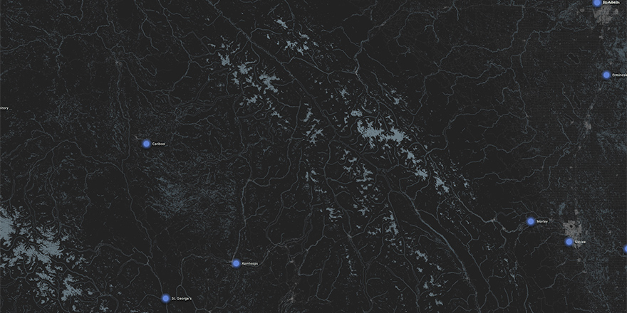

The thickness of drawn shorelines increases as the user zooms in.

### Permanent Snow & Ice
A secondary element to the aesthetic of the map is the presence of permanent snow and ice. This dataset is relatively small – there isn't much left – however, it provides additional depth when incorporated over shoreline data.

> The data files for shorelines can be found here: [NRC Permanent Snow and Ice Data](http://ftp.geogratis.gc.ca/pub/nrcan_rncan/vector/canvec/shp/Hydro/)

The most prominent set of permanent snow and ice is in north eastern Canada.

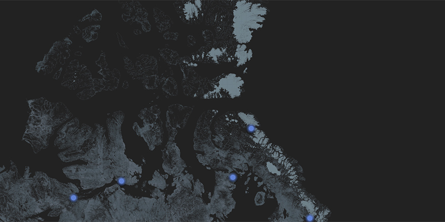

There is quite a decent amount in north western British Columbia.

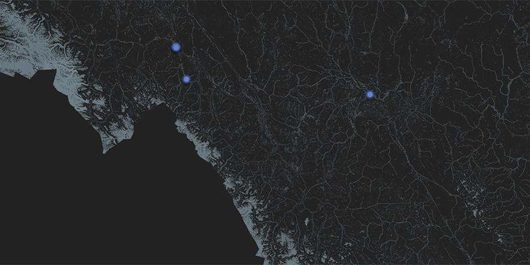

Here is a detail view of the above image.

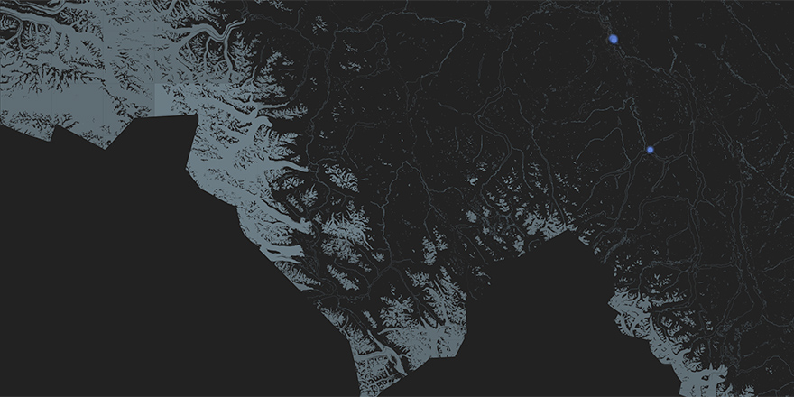

There are also instances in central B.C., typically at the top of mountain ranges.

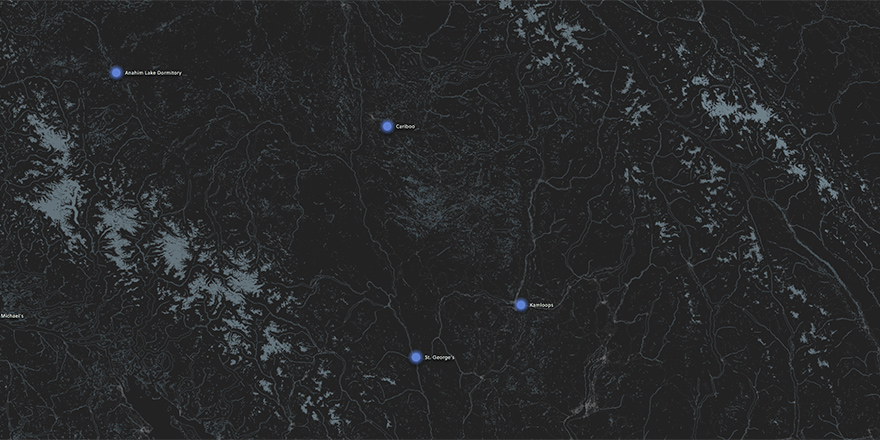

Here is a detail view of the above image.

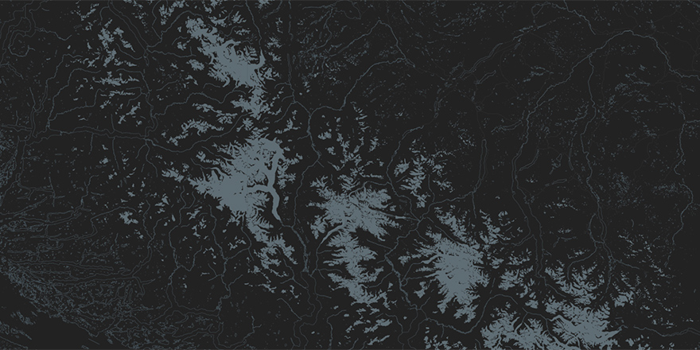

### Roads
The third level of the map aesthetic is a tracing of road segments throughout the country. This component provides an even greater level of depth to the look of the map. More importantly, it provides spatial context to the location of annotations on the map.

> The data files for road segments can be found here: [NRC Road Segment Data](http://ftp.geogratis.gc.ca/pub/nrcan_rncan/vector/canvec/shp/Transport/)

When zoomed out, the proximity and style of roads brighten metropolitan areas such as Toronto (centre-left), and Ottawa (top-right).

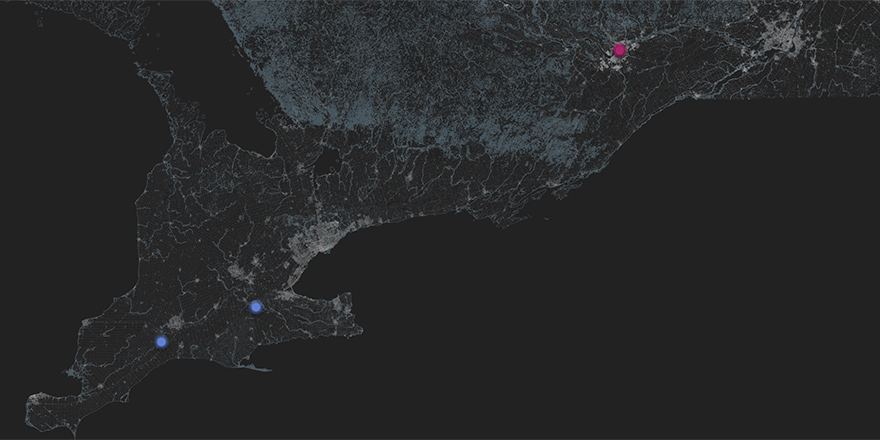

As the user zooms in, roads become less apparent. In the following image, Toronto is visible but less bright than when zoomed out.

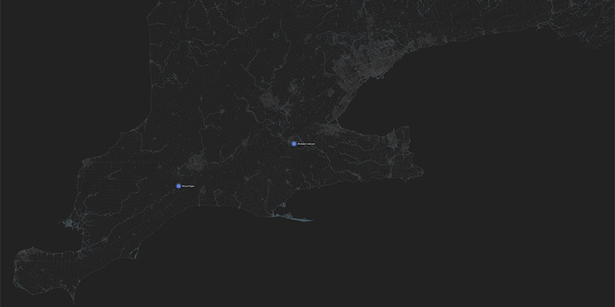

Through dynamic styling, roads continue to become less apparent the more zoomed in. Here we see Toronto and the Niagara region, but shorelines and annotations are more prominent.

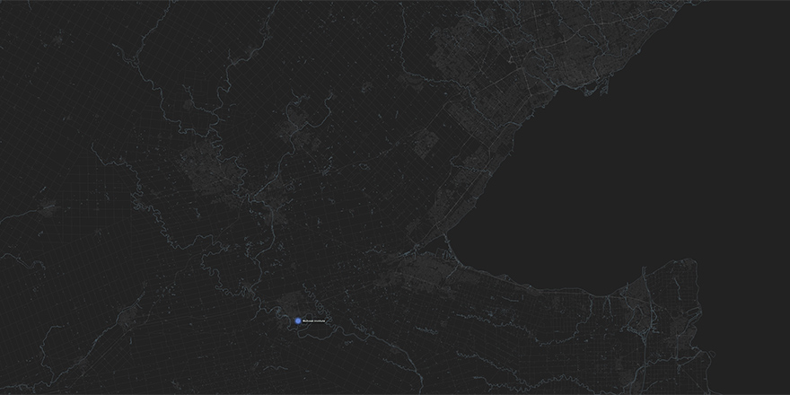

At the deepest zoom level roads continue to show structure, but effectively become an aesthetic texture.

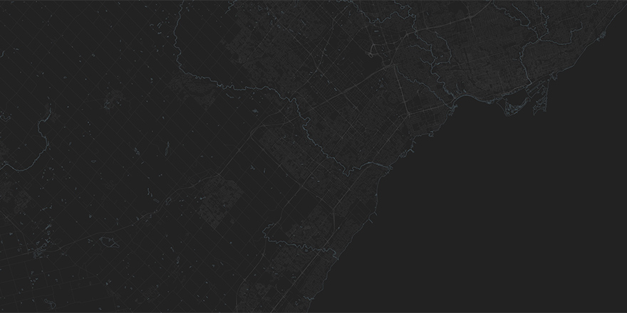